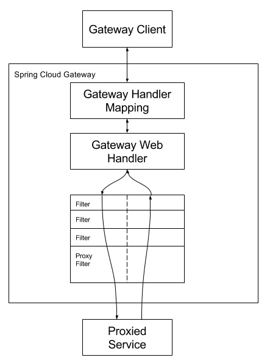

# spring-cloud-study
Spring Cloud相关组件学习笔记

## 网关能干什么？在微服务架构中扮演的角色？

> 网关=路由转发 + 过滤器
1. 路由转发：接收到的一切请求，转发到后端对应的微服务上去
2. 过滤器：在服务网关中完成一系列的横切功能，例如权限校验、限流及监控等，这些都可以通过过滤器完成（其实路由转发也是通过过滤器实现的）
## Spring Cloud Gateway
### 背景介绍
话说在 Spring Cloud Gateway 问世之前，Spring Cloud 的微服务世界里，网关一定非 Netflix Zuul 莫属。但是由于 Zuul 1.x 存在的一些问题，比如阻塞式的 API，不支持 WebSocket 等，一直被人所诟病，而且 Zuul 升级新版本依赖于 Netflix 公司，经过几次跳票之后，Spring 开源社区决定推出自己的网关组件，替代 Netflix Zuul。

从 18 年 6 月 Spring Cloud 发布的 Finchley 版本开始，Spring Cloud Gateway 逐渐崭露头角，它基于 Spring 5.0、Spring Boot 2.0 和 Project Reactor 等技术开发，不仅支持响应式和无阻塞式的 API，而且支持 WebSocket，和 Spring 框架紧密集成。尽管 Zuul 后来也推出了 2.x 版本，在底层使用了异步无阻塞式的 API，大大改善了其性能，但是目前看来 Spring 并没有打算继续集成它的计划。

### 主要特性
根据[官网](https://spring.io/projects/spring-cloud-gateway)的描述，Spring Cloud Gateway 的主要特性如下：

- Built on Spring Framework 5, Project Reactor and Spring Boot 2.0
- Able to match routes on any request attribute
- Predicates and filters are specific to routes
- Hystrix Circuit Breaker integration
- Spring Cloud DiscoveryClient integration
- Easy to write Predicates and Filters
- Request Rate Limiting
- Path Rewriting

可以看出Spring Cloud Gateway 很方便的和Spring Cloud生态中的其他组件进行集成（比如：断路器和服务发现），而且提供了一套简单易写的断言（Predicates,也可以翻译成谓词）和过滤器（Filters）机制，可以对每个路由（Routes）进行特殊请求处理。

## 网关整体架构

### 核心概念
| 组件 | 对应抽象类 | 描述 |
| ---- | ---- | ---- |
| Route（路由） | org.springframework.cloud.gateway.route.Route | 网关最基本的模块。由一个ID、一个目标URL、一组断言（Predicate）和一组过滤器（Filter）组成。|
| Predicate（断言）| | 路由转发的判断条件，通过Predicate对HTTP请求进行匹配，例如：请求方式、请求路径、请求头、参数等，如果请求与断言匹配成功，则将请求转发到对应的服务|
| Filter（过滤器）| | 我们使用Filter对请求进行拦截和修改，还可以使用它对上下文响应进行再处理 |

#### Predicate断言
Spring Cloud Gateway通过Predicate断言来实现Route路由的匹配规则。简单点说，Predicate是路由转发的判断条件，
请求只有满足了Predicate的条件，才会被转发到指定的服务上进行处理。

使用Predicate断言主要注意以下3点：

- Route路由与Predicate断言的对应关系为"一对多"，一个路由可以包含多个不同的断言
- 一个请求想要转发到指定的路由上，就必须 <font color=red>同时匹配</font> 路由上的所有断言
- 当一个请求同时满足多个路由的断言条件时，请求只会被首个成功匹配的路由转发


Spring Cloud Gateway工程提供了12个断言，想了解每个断言的区别，请参考[官网](https://docs.spring.io/spring-cloud-gateway/docs/current/reference/html/#gateway-request-predicates-factories)。

如果Gateway提供的断言不满足自己的需求，想自己定义断言的时候，有一点需要注意。查看官网提供的`RoutePredicateFactory`实现和在路由中配置的断言名称他们是如何关联起来的。

[webflux](https://cloud.tencent.com/developer/article/1888001)

#### Filter过滤器
Spring Cloud Gateway提供了两种类型的过滤器，可以对请求和响应做精细化控制。

| 过滤器类型 | 说明 |
| ---- | ---- |
| Pre类型 | 这种过滤器在请求被转发到微服务之前可以对请求进行拦截和修改，例如：参数校验、权限校验、流量监控、日志输出以及协议转换等操作 |
| Post类型 | 这种过滤器在微服务对请求做出响应后可以对响应进行拦截和再处理，例如：修改影响内容或响应头、日志输出、流量监控等 |

按照作用范围可划分为
- GatewayFilter：应用在单个路由或者一组路由上的过滤器
- GlobalFilter：应用在所有的路由上的过滤器

**GatewayFilter网关过滤器**
网关过滤器是Spring Cloud Gateway提供的一种应用于单个或者一组路由上的过滤器。它可以对单个路由器或者一组路由器上传入的请求和传出的响应进行拦截，
并实现一些与业务无关的功能，比如：登录状态校验、签名验证、权限校验、日志输出、流量监控等。

GatewayFilter在配置文件中的写法与Predicate类似，格式如下：
````yaml
spring:
  cloud:
    gateway: 
      routes:
        - id: xxxx
          uri: xxxx
          predicates:
            - Path=xxxx
          filters:
            - AddRequestParameter=X-Request-Id,1024 #过滤器工厂会在匹配的请求头加上一对请求头，名称为 X-Request-Id 值为 1024
            - PrefixPath=/dept #在请求路径前面加上 /dept
            ……
````
Spring Cloud Gateway内置了多达30多种GatewayFilter[官网链接](https://docs.spring.io/spring-cloud-gateway/docs/current/reference/html/#gatewayfilter-factories)，下面我们列举几种常用的网关过滤器及其使用示例。

| 路由过滤器 | 描述 | 使用示例 |
| ---- | ---- |  ---- |
| AddRequestHeader | 拦截传入的请求，并在请求上添加一个指定的请求头参数 | - AddRequestHeader=my-request-header,1024 |
| AddRequestParameter | 拦截传入的请求，并在请求上添加一个指定的请求参数 | - AddRequestParameter=my-request-param,c.biancheng.net |
| AddResponseHeader | 拦截请求，并在响应上添加一个指定的响应头参数 | - AddResponseHeader=my-response-header,c.biancheng.net |
| PrefixPath | 拦截传入的请求，并在请求路径上添加一个指定的前缀 | - PrefixPath=/consumer |
| RequestSize | 配置请求体的大小，当请求体过大时，将会返回413 Payload Too Large。| - RequestSize=maxSize,5000000 |

GlobalFilter全局过滤器
GlobalFilter是一种作用于所有路由上的全局过滤器，通过它，我们可以实现一些统一化的业务功能，例如：权限认证、IP访问限制等。当某个请求被路由匹配时，所有的GlobalFilter会和该路由自身配置的GatewayFilter组合成一个过滤器链。

Spring Cloud Gateway为我们提供了多种默认的GlobalFilter，例如：转发、路由、负载均衡等相关的全局过滤器。但在
实际的项目开发中，通常我们都会自定义一些自己的GlobalFilter全局过滤器以满足我们自身的业务需求，而很少直接使用Spring Cloud Gateway
提供的默认GlobalFilter。

### 工作流程


下面是Spring Cloud Gateway[官网的介绍](https://docs.spring.io/spring-cloud-gateway/docs/current/reference/html/#gateway-how-it-works)
> Clients make requests to Spring Cloud Gateway. If the Gateway Handler Mapping determines that a request matches a route, 
> it is sent to the Gateway Web Handler. This handler runs the request through a filter chain that is specific to the request. 
> The reason the filters are divided by the dotted line is that filters can run logic both before and after the proxy request is sent. 
> All “pre” filter logic is executed. Then the proxy request is made. After the proxy request is made, the “post” filter logic is run.
>
> 客户端向 Spring Cloud Gateway 发出请求。然后在 Gateway Handler Mapping 中找到与请求相匹配的路由，
> 将其发送到 Gateway Web Handler。Handler 再通过指定的过滤器链来将请求发送到我们实际的服务执行业务逻辑，然后返回。
> 过滤器之间用虚线分开是因为过滤器可能会在发送代理请求之前（“pre”）或之后（“post”）执行业务逻辑。

## 网关路由

## 网关限流
Spring Cloud Gateway是通过`GatewayRedisAutoConfiguration`自动配置类来自动装配`RedisRateLimiter`，
然后在`GatewayAutoConfiguration`自动配置类中根据`RedisRateLimiter`构造`RequestRateLimiterGatewayFilterFactory`,这个类是一个`GatewayFilter`，由此可知，Spring Cloud Gateway是通过过滤器来实现的。

| 组件类名 | 说明 |
| ---- | ---- |
| RedisScript | 加载`META-INF/scripts/request_rate_limiter.lua`对lua脚本进行简单封装 |
| RedisRouteDefinitionRepository | 提供使用redis对路由信息的存储，通过`spring.cloud.gateway.redis-route-definition-repository.enabled`开启 |
| RedisRateLimiter | 具体限流逻辑的封装 |

Spring Cloud Gateway限流使用的[Token Bucket Algorithm(令牌桶算法)](https://en.wikipedia.org/wiki/Token_bucket)，具体通过`RedisRateLimiter` + `lua脚本`实现。
执行脚本需要2个keys和3个args:

- key的生成
```shell script
static List<String> getKeys(String id) {
    // use `{}` around keys to use Redis Key hash tags
    // this allows for using redis cluster

    // Make a unique key per user.
    String prefix = "request_rate_limiter.{" + id;

    // You need two Redis keys for Token Bucket.
    String tokenKey = prefix + "}.tokens";          // request_rate_limiter.{id}.tokens  
    String timestampKey = prefix + "}.timestamp";   // request_rate_limiter.{id}.timestamp
    return Arrays.asList(tokenKey, timestampKey);
}
```
- 脚本入参

| 参数 | 描述 |
|---- | ---- |
| redis-rate-limiter.replenishRate | 令牌桶每秒填充的平均速率 |
| redis-rate-limiter.burstCapacity | 令牌桶的总容量 |
| redis-rate-limiter.requestedTokens | 请求的令牌个数 |

#### 具体实现
```shell script
redis.replicate_commands()

local tokens_key = KEYS[1]       -- 用来存储上次剩余的令牌个数 request_rate_limiter.{id}.tokens
local timestamp_key = KEYS[2]    -- 用来存储上次请求的时间戳  request_rate_limiter.{id}.timestamp

local rate = tonumber(ARGV[1])         -- 定义的令牌生成速度
local capacity = tonumber(ARGV[2])     -- 定义的令牌最多数量
local now = redis.call('TIME')[1]      -- 当前时间
local requested = tonumber(ARGV[4])    -- 本次请求的令牌个数

local fill_time = capacity/rate        -- 填满令牌池所需要的时间
local ttl = math.floor(fill_time*2)    -- 过期时间是填满令牌池所需时间的2倍

local last_tokens = tonumber(redis.call("get", tokens_key))    -- 获取上次剩余的令牌数
if last_tokens == nil then
  last_tokens = capacity       -- 如果key不存在 说明要么是第一次请求 要么就是达到了key失效时间 redis删掉了                   
end                            -- 这两种情况下令牌数都应该是最大令牌数

local last_refreshed = tonumber(redis.call("get", timestamp_key))   -- 最近一次获取令牌的时间
if last_refreshed == nil then
  last_refreshed = 0            -- 如果不存在 说明要么没有获取过  要么达到的key的失效时间
end

local delta = math.max(0, now-last_refreshed)                         -- 距最近一次获取token的时间差
local filled_tokens = math.min(capacity, last_tokens+(delta*rate))    -- 此刻令牌的个数
local allowed = filled_tokens >= requested      -- 判断当前的令牌的个数是否满足请求的令牌个数         
local new_tokens = filled_tokens                -- 初始化返回变量  剩余的令牌数      
local allowed_num = 0                           -- 初始化返回变量  获取令牌是否成功 0:失败 1:成功 
if allowed then
  new_tokens = filled_tokens - requested        -- 重新返回变量  剩余的令牌数=当前令牌数 - 本次请求的令牌数
  allowed_num = 1                               -- 重置返回变量  设置获取令牌成功
end

if ttl > 0 then
  redis.call("setex", tokens_key, ttl, new_tokens)    -- 保存剩余的令牌个数并设置过期时间
  redis.call("setex", timestamp_key, ttl, now)        -- 保存本次请求的时间戳并设置过期时间
end                                                   -- 这两个key的过期时间一样 2倍的填满令牌桶的时间

return { allowed_num, new_tokens }          -- 返回 {是否成功, 剩余的令牌数}
```

## 负载均衡
Spring Cloud Gateway是通过`ReactiveLoadBalancerClientFilter`来实现负载均衡的。在gateway中通过`GatewayReactiveLoadBalancerClientAutoConfiguration`来自动装配
`ReactiveLoadBalancerClientFilter`，此配置类是在`LoadBalancerAutoConfiguration`（由spring-cloud-loadbalancer提供）之后进行处理，在`LoadBalancerAutoConfiguration`自动装配好`LoadBalancerClientFactory`
由此可见，`ReactiveLoadBalancerClientFilter`作为一个`GlobalFilter`只是将请求进行拦截，最终负载均衡还是交给loadbalancer的具体实现来完成。下面看看这个过滤器的实现：
```java
public class ReactiveLoadBalancerClientFilter implements GlobalFilter, Ordered {

	private final LoadBalancerClientFactory clientFactory;
	private final GatewayLoadBalancerProperties properties;

	public ReactiveLoadBalancerClientFilter(LoadBalancerClientFactory clientFactory,
			GatewayLoadBalancerProperties properties) {
		this.clientFactory = clientFactory;
		this.properties = properties;
	}

	@Override
	public int getOrder() {
		return 10150;
	}

	@Override
	public Mono<Void> filter(ServerWebExchange exchange, GatewayFilterChain chain) {
		URI url = exchange.getAttribute(GATEWAY_REQUEST_URL_ATTR);
		String schemePrefix = exchange.getAttribute(GATEWAY_SCHEME_PREFIX_ATTR);
        // 判断是否需要处理
		if (url == null || (!"lb".equals(url.getScheme()) && !"lb".equals(schemePrefix))) {
			return chain.filter(exchange);
		}

		URI requestUri = exchange.getAttribute(GATEWAY_REQUEST_URL_ATTR);
        // 获取服务标识
		String serviceId = requestUri.getHost();
		Set<LoadBalancerLifecycle> supportedLifecycleProcessors = LoadBalancerLifecycleValidator
				.getSupportedLifecycleProcessors(clientFactory.getInstances(serviceId, LoadBalancerLifecycle.class),
						RequestDataContext.class, ResponseData.class, ServiceInstance.class);
		DefaultRequest<RequestDataContext> lbRequest = new DefaultRequest<>(
				new RequestDataContext(new RequestData(exchange.getRequest()), getHint(serviceId)));
		LoadBalancerProperties loadBalancerProperties = clientFactory.getProperties(serviceId);
		return choose(lbRequest, serviceId, supportedLifecycleProcessors).doOnNext(response -> {
		            // 处理响应结果 状态码判断等
                }).then(chain.filter(exchange))
				.doOnError(throwable -> {
				    // 异常处理逻辑    
                 })
				.doOnSuccess(aVoid -> {
				    // 正常响应处理逻辑
}                );
	}

	private Mono<Response<ServiceInstance>> choose(Request<RequestDataContext> lbRequest, String serviceId,
			Set<LoadBalancerLifecycle> supportedLifecycleProcessors) {
        // 
		ReactorLoadBalancer<ServiceInstance> loadBalancer = this.clientFactory.getInstance(serviceId,
				ReactorServiceInstanceLoadBalancer.class);
		if (loadBalancer == null) {
			throw new NotFoundException("No loadbalancer available for " + serviceId);
		}
		supportedLifecycleProcessors.forEach(lifecycle -> lifecycle.onStart(lbRequest));
		return loadBalancer.choose(lbRequest);
	}
}
```
